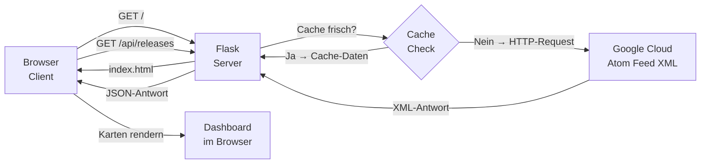

# 📘 Projektübersicht: BigQuery Release Notes Dashboard

## Architektur auf einen Blick



---

## 🖥️ Serverseite — `app.py`

### 1. Konfiguration & Cache

```python
FEED_URL = "https://docs.cloud.google.com/feeds/bigquery-release-notes.xml"
CACHE_DURATION = 300  # 5 Minuten

feed_cache = {
    "data": None,
    "last_fetched": 0
}
```

- `FEED_URL` ist die offizielle Google-Quelle im **Atom-XML-Format**
- `feed_cache` ist ein einfaches Python-Dictionary im RAM — kein Redis, keine Datenbank
- Zwei Felder: `data` (die gespeicherten Einträge) und `last_fetched` (Unix-Timestamp des letzten Abrufs)

---

### 2. `parse_release_feed()` — Das Herzstück

```python
def parse_release_feed():
    req = urllib.request.Request(
        FEED_URL,
        headers={'User-Agent': 'Mozilla/5.0 ...'}
    )
    with urllib.request.urlopen(req, timeout=10) as response:
        xml_data = response.read()

    root = ET.fromstring(xml_data)
    ns = root.tag.split("}")[0] + "}"  # z.B. "{http://www.w3.org/2005/Atom}"

    entries = []
    for entry_el in root.findall(f"{ns}entry"):
        entries.append({
            "title":   title_el.text,
            "id":      id_el.text,
            "updated": updated_el.text,
            "link":    link_href,
            "content": content_el.text   # HTML als String
        })
    return entries, None
```

**Was passiert hier Schritt für Schritt:**

| Schritt | Aktion |
|---------|--------|
| ① | HTTP-GET an Google mit Browser-User-Agent (verhindert Blockierung) |
| ② | XML-Rohdaten werden als Bytes eingelesen |
| ③ | XML wird geparst; der Atom-Namespace wird automatisch erkannt |
| ④ | Jedes `<entry>`-Element wird in ein Python-Dictionary umgewandelt |
| ⑤ | Liste aller Einträge + `None` (kein Fehler) wird zurückgegeben |

> **Namespace-Erkennung:** Atom-XML hat Tags wie `{http://www.w3.org/2005/Atom}entry`.
> Der Code schneidet den Namespace automatisch heraus, damit `findall()` korrekt funktioniert.

---

### 3. `GET /` — Die Startseite

```python
@app.route("/")
def index():
    return render_template("index.html")
```

Einfachste Route: Flask sucht `templates/index.html` und sendet sie als HTML-Antwort.

---

### 4. `GET /api/releases` — Die Daten-API

```python
@app.route("/api/releases")
def get_releases():
    force_refresh = request.args.get("refresh", "false").lower() == "true"
    current_time = time.time()

    # Cache prüfen
    if not force_refresh and feed_cache["data"] is not None \
       and (current_time - feed_cache["last_fetched"]) < CACHE_DURATION:
        return jsonify({"status": "success", "source": "cache", ...})

    # Neu laden
    releases, error = parse_release_feed()

    if error:
        if feed_cache["data"] is not None:
            return jsonify({"status": "warning", "source": "cache_fallback", ...})
        return jsonify({"status": "error", ...}), 500

    # Cache aktualisieren
    feed_cache["data"] = releases
    feed_cache["last_fetched"] = current_time
    return jsonify({"status": "success", "source": "network", ...})
```

**Cache-Logik (3 Szenarien):**

```
Anfrage kommt rein
       │
       ├─ Cache frisch & kein force_refresh?  ──→  Cache zurückgeben  (source: "cache")
       │
       ├─ Cache abgelaufen / force_refresh?
       │       │
       │       ├─ Fetch erfolgreich?  ──→  Cache updaten & zurückgeben  (source: "network")
       │       │
       │       └─ Fetch fehlgeschlagen?
       │               │
       │               ├─ Alter Cache vorhanden?  ──→  Fallback  (source: "cache_fallback")
       │               └─ Kein Cache?  ──→  HTTP 500 Fehler
```

---

## 🌐 Clientseite — `templates/index.html`

### 1. `fetchReleases(forceRefresh)` — Daten laden

```javascript
function fetchReleases(forceRefresh) {
    refreshBtn.classList.add('loading');          // Dreh-Animation starten
    setStatus('', 'Loading…');
    errorBanner.classList.remove('visible');

    fetch('/api/releases' + (forceRefresh ? '?refresh=true' : ''))
        .then(res => res.json())
        .then(data => {
            allReleases = data.releases.map(r => ({
                ...r,
                _category:   detectCategory(r),   // Kategorie erkennen
                _searchText: (r.title + r.content).toLowerCase()
            }));
            updateCounts(allReleases);  // Filter-Badge-Zahlen aktualisieren
            renderCards();              // Karten zeichnen
        })
        .catch(err => { /* Fehler-Banner zeigen */ })
        .finally(() => refreshBtn.classList.remove('loading'));
}
```

---

### 2. `detectCategory(entry)` — Automatische Klassifizierung

```javascript
const CATEGORY_RULES = [
    { key: 'breaking',    pattern: /breaking[\s-]change|removed\s+support/i },
    { key: 'deprecation', pattern: /deprecat/i },
    { key: 'preview',     pattern: /preview|alpha|beta|experimental/i },
    { key: 'fix',         pattern: /bug[\s-]?fix|fixed|patch|resolved/i },
    { key: 'feature',     pattern: /feature|new\s|announc|launch|introduc/i },
];
```

Der Text aus `title` + `content` wird gegen **5 Regex-Muster** geprüft — in Prioritätsreihenfolge.
Passt keines: Kategorie = `"other"`.

---

### 3. `renderCards()` — Filtern & Anzeigen

```javascript
function renderCards() {
    const filtered = allReleases.filter(r => {
        const matchFilter = activeFilter === 'all' || r._category === activeFilter;
        const matchSearch = !searchQuery || r._searchText.includes(searchQuery);
        return matchFilter && matchSearch;
    });
    // DOM leeren, neue Karten einfügen
    filtered.forEach((r, i) => grid.appendChild(buildCard(r, i)));
}
```

Beide Bedingungen müssen gleichzeitig erfüllt sein:
- **Filter-Button** (z.B. "Feature") → `matchFilter`
- **Suchbegriff im Textfeld** → `matchSearch`

---

## 🔄 Beispielablauf: Nutzer öffnet die Seite zum ersten Mal

```
1. Browser: GET http://127.0.0.1:5000/
   ↓
2. Flask: render_template("index.html") → sendet HTML
   ↓
3. Browser: lädt index.html, zeigt 3 Skeleton-Karten
   ↓
4. JavaScript: fetchReleases(false) → GET /api/releases
   ↓
5. Flask: Cache ist leer → ruft parse_release_feed() auf
   ↓
6. Flask: HTTP-GET → https://docs.cloud.google.com/feeds/bigquery-release-notes.xml
   ↓
7. Google: antwortet mit XML (hunderte <entry>-Elemente)
   ↓
8. Flask: parst XML → Liste von Dictionaries → in feed_cache speichern
   ↓
9. Flask: JSON-Antwort →
   {
     "status": "success",
     "source": "network",
     "last_updated": 1750104177.3,
     "releases": [ { "title": "...", "updated": "2026-06-10T00:00:00Z", ... }, ... ]
   }
   ↓
10. JavaScript: empfängt JSON → detectCategory() für jeden Eintrag
    ↓
11. JavaScript: Skeleton-Karten entfernen → Release-Karten animiert einblenden
    ↓
12. Status-Dot: 🟢 "Live · 10:05 PM"
```

---

## ⚡ Zweiter Aufruf — Cache greift

```
Nutzer drückt F5 (innerhalb von 5 Minuten)
   ↓
GET /api/releases
   ↓
Flask: (current_time - last_fetched) < 300  →  Cache-Treffer!
   ↓
JSON sofort zurück: { "source": "cache", ... }
   ↓
Status-Dot: 🟡 "Cached · 10:05 PM"
   → Kein externer HTTP-Request, keine Wartezeit
```

---

## 🔴 Fehlerfall — Google nicht erreichbar

```
Nutzer klickt "Refresh"
   ↓
GET /api/releases?refresh=true
   ↓
Flask: force_refresh=True → parse_release_feed()
   ↓
urllib.urlopen() → Timeout / ConnectionError
   ↓
feed_cache["data"] vorhanden? JA
   ↓
JSON: { "status": "warning", "source": "cache_fallback", "error": "..." }
   ↓
Client: zeigt gelbes Warn-Banner "Fetch failed — showing cached data"
   → Nutzer sieht weiterhin Daten, kein leerer Bildschirm
```
